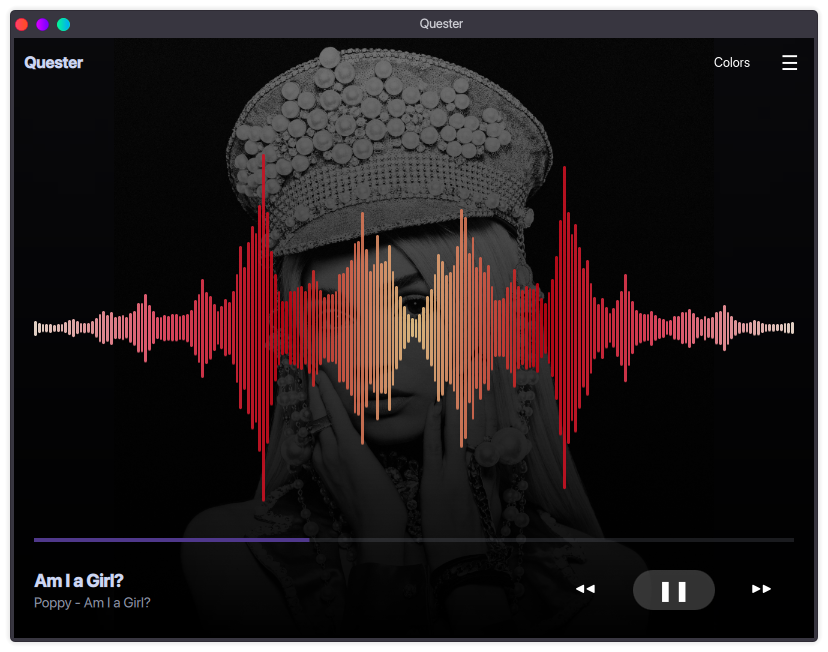
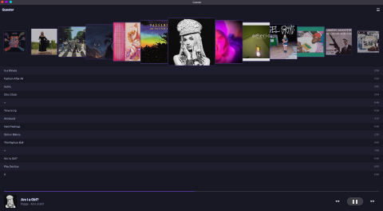

# Quester [](LICENSE)

> ## A modern, visually rich MPD client built with Qt 6 and QML

## Table of Contents

- [About](#about)
- [Features](#features)
- [Prerequisites](#prerequisites)
- [Installation](#installation)
- [Usage](#usage)
- [Visualizer Configuration](#visualizer-configuration)
- [Statistics & Scrobbling](#statistics--scrobbling)
- [Contributing](#contributing)
- [License](#license)

## About

Quester is a desktop client for the Music Player Daemon (MPD). It provides a fluid user interface focused on album art and visual feedback. Built using C++ and Qt Quick (QML), it aims to offer a lightweight yet visually appealing way to browse and play your music library.

## Features

- **Album Browser:** Cover-flow style navigation and Grid View for your music library.
- **Dual Visualizers:**
  - **Spectrum Analyzer:** Custom bar visualizer using FFTW with customizable color presets.
- **MPRIS Support:** Full D-Bus integration for control via system media keys, desktop widgets, and multimedia keyboards.
- **Multiple Audio Sources:** Support for PulseAudio, PipeWire, FIFO (MPD audio output), and macOS CoreAudio.
- **Automatic Artwork:** Fetches album art from MPD (embedded/local), TheAudioDB, or Last.fm.
- **Playback Control:** Standard controls (Play, Pause, Next, Previous) and seek bar.
- **Queue Management:** Manage your play queue and playlists easily.
- **Statistics Tracking:** Track your listening habits with weekly, monthly, yearly, and all-time stats.
- **Scrobbling:** Submit plays to ListenBrainz and Last.fm.
- **Wrapped Feature:** Generate year-in-review style summaries of your listening history.
- **Duplicate Finder:** Find and remove duplicate files in your music library.
- **System Tray:** Minimize to system tray with playback controls.
- **Touch Ready:** UI elements sized and spaced for touch interaction.

## Gallery




## Prerequisites

To build Quester, you need the following dependencies installed on your system:

- **C++ Compiler** (supporting C++23)
- **CMake** (3.16 or higher)
- **Qt 6** (6.5 or higher)
- **KDE Frameworks 6** (Kirigami)
- **libmpdclient**
- **FFTW3** (optional, Kiss FFT is used as fallback on Linux)
- **PulseAudio** (libpulse)
- **PipeWire** (libpipewire-0.3, libspa-0.2)

### Ubuntu/Debian

```bash
sudo apt install build-essential cmake \
    qt6-base-dev qt6-declarative-dev qt6-multimedia-dev qt6-sql-dev qt6-xml-dev \
    libmpdclient-dev libfftw3-dev libpulse-dev \
    libpipewire-0.3-dev libspa-0.2-dev \
    kirigami2-dev libkirigami-dev extra-cmake-modules
```

**Note:** projectM is included as a git submodule and does not need to be installed separately.

## Installation

1. Clone the repository and initialize submodules:

   ```bash
   git clone https://codeberg.org/anoraktrend/Quester.git
   cd Quester
   git submodule update --init --recursive
   ```

2. Create a build directory and configure with CMake:

   ```bash
   mkdir build
   cd build
   cmake ..
   ```

3. Build the application:

   ```bash
   make
   ```

4. (Optional) Install system-wide:

   ```bash
   sudo make install
   ```

## Usage

Ensure your MPD server is running. By default, Quester attempts to connect to `localhost` on port `6600`. You can change these settings in the **General** tab of the **Settings** window.

Run the application from the build directory:

```bash
./quester
```

## Visualizer Configuration

### Bar Visualizer Presets

Quester allows you to customize the bar visualizer colors by creating preset files.
To add your own presets, create a directory named `presets` inside your Quester config folder (e.g., `~/.config/Quester/presets/`) and add a `.json` file there.

**JSON Structure:**

The JSON file should contain a single root object where keys are preset names and values are color definitions.

*Simple Color List (Gradient):*

```json
{
  "Rainbow": ["#E50000", "#FF8D00", "#FFEE00", "#028121", "#004CFF", "#770088"]
}
```

*Weighted Gradients:*

```json
{
   "Uneven": {
      "colors": ["#FF0000", "#00FF00", "#0000FF"],
      "weights": [1, 4, 1]
   }
}
```

### projectM

Quester supports projectM visualizations. You can configure the preset path, texture size, and other rendering settings in the application settings dialog.

## Statistics & Scrobbling

Quester includes built-in statistics tracking and supports scrobbling to multiple services.

### Statistics Tracking

Quester automatically tracks your listening habits and stores them locally in a SQLite database. View your statistics in the app:

- **Weekly:** Most played artists, albums, and songs from the past 7 days
- **Monthly:** Listening statistics for the current month
- **Yearly:** Year-to-date statistics
- **All Time:** Complete listening history since you started using Quester

### Wrapped Feature

At the end of each year, Quester can generate a "Wrapped" summary - a visual recap of your listening habits including:

- Top artists, albums, and songs
- Total listening time
- Activity graphs showing when you listen to music
- Album art collages

### ListenBrainz Integration

Quester can submit your plays to [ListenBrainz](https://listenbrainz.org/), a free and open-source music tracking service.

1. Go to Settings → Statistics
2. Enter your ListenBrainz token (get it from your ListenBrainz profile)
3. Enable automatic submissions

### Last.fm Integration

Quester supports scrobbling to Last.fm:

1. Go to Settings → Statistics
2. Click "Connect to Last.fm"
3. Authorize Quester to access your account
4. Your plays will be automatically submitted

## Contributing

Contributions are what make the open source community such an amazing place to learn, inspire, and create. Any contributions you make are **greatly appreciated**.

1. Fork the Project
2. Create your Feature Branch (`git checkout -b feature/AmazingFeature`)
3. Commit your Changes (`git commit -m 'Add some AmazingFeature'`)
4. Push to the Branch (`git push origin feature/AmazingFeature`)
5. Open a Pull Request

## License

Distributed under the MIT License. See `LICENSE` for more information.
